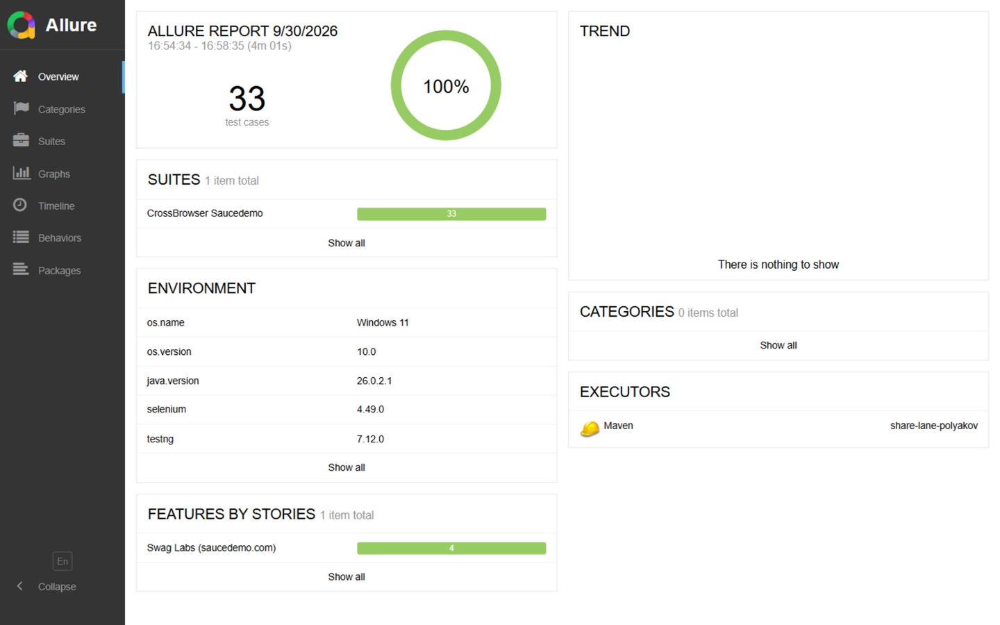
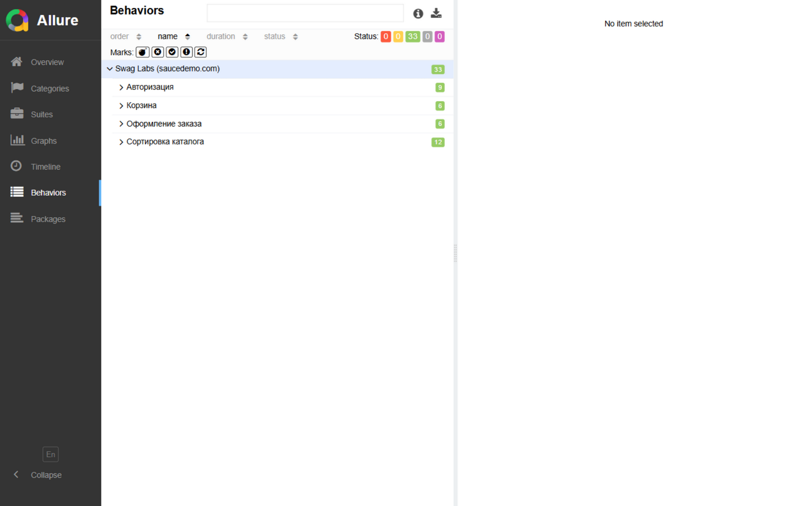
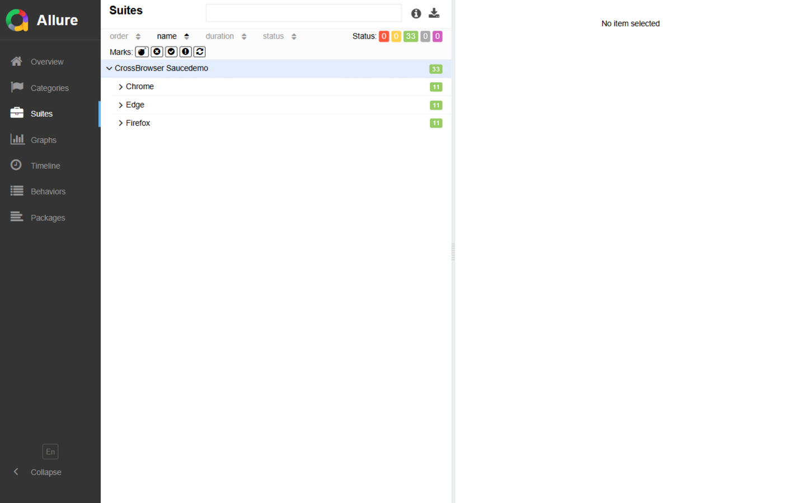
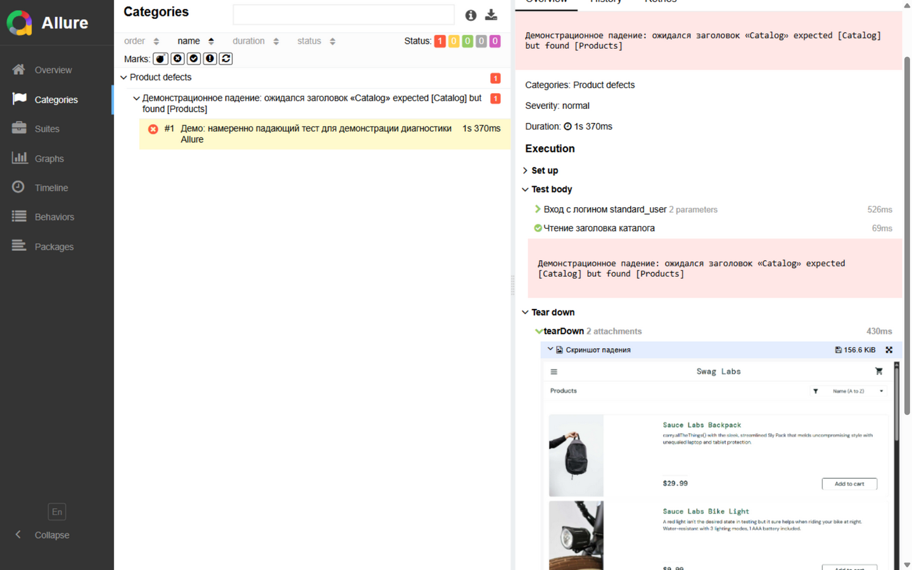

# Практическое занятие №14–16. Подключение Allure к проекту Soucedemo. Кроссбраузерное тестирование

**Дисциплина:** Автоматизация тестирования
**Студент:** Полеяков Иван (<группа>)
**Дата:** 30.09.2026

## 1. Ссылки на артефакты

| Артефакт | Значение |
|---|---|
| Репозиторий | https://github.com/hilarylfg/practice-qa-polyakov |
| Feature-ветка | `feature/polyakov_saucedemo_allure` |
| Pull Request | https://github.com/hilarylfg/practice-qa-polyakov/pull/2 |
| Последний коммит | см. `git rev-parse HEAD` (указан в PR) |

Работа выполняется поверх ветки `feature/polyakov_saucedemo` (практика №13): существующий
набор из 11 тестов saucedemo.com дополнен отчётностью Allure и кроссбраузерным прогоном.

## 2. Описание среды

| Компонент | Версия |
|---|---|
| ОС | Windows 11 (10.0.28000, x64) |
| JDK | OpenJDK 26.0.2.1 (компиляция `--release 21`) |
| Maven | 3.9.16 |
| Браузеры | Chrome 153.0.8010.53; Firefox 157.0; Edge (Chromium, актуальный канал) |
| Драйверы | ChromeDriver / GeckoDriver / EdgeDriver — авторазрешение WebDriverManager 6.3.4 |
| Selenium | selenium-java 4.49.0 |
| TestNG | 7.12.0 (maven-surefire-plugin 3.5.2) |
| Allure | allure-testng 2.29.1 + allure-maven 2.15.2; AspectJ Weaver 1.9.22.1 (LTW для @Step) |

Команды запуска:
- одиночный браузер: `mvn clean test` (по умолчанию Chrome), выбор: `-Dbrowser=firefox|edge|chrome -Dheadless=true|false`;
- кроссбраузерный параллельный: `mvn clean test -Pcrossbrowser` (testng-crossbrowser.xml, `parallel="tests"`, 3 потока);
- отчёт: `mvn allure:report` → `target/site/allure-maven-plugin/index.html`; быстрый просмотр `mvn allure:serve`.

## 3. Интеграция Allure

- **Адаптер `allure-testng`** саморегистрируется через ServiceLoader и пишет JSON-результаты
  в `target/allure-results` (71+ файл за прогон: result/container JSON, вложения).
- **Плагин `allure-maven`** генерирует HTML-отчёт (`allure:report`) и сервер предпросмотра (`allure:serve`).
- **Шаги**: аннотации `@Step` на бизнес-методах Page Object'ов («Вход с логином {username}»,
  «Добавить в корзину товар «{itemId}»», «Сортировка каталога: {option}»…). Для работы LTW
  в surefire подключён javaagent AspectJ (`-javaagent:…aspectjweaver…jar`), компиляция
  переведена на `--release 21` (weaver не поддерживает новейшие версии class-файлов).
- **Метки**: `@Epic("Swag Labs (saucedemo.com)")`, `@Feature` (Авторизация / Корзина /
  Оформление заказа / Сортировка каталога), `@Story` на каждый тест, `@Severity`
  (BLOCKER/CRITICAL/NORMAL), `@Owner` — группировка видна на странице Behaviors.
- **Вложения**: при любом падении `tearDown` (alwaysRun) прикладывает скриншот страницы
  («Скриншот падения») и DOM-дамп («DOM-дамп на момент падения») — `utils/AllureAttachments`.
- **Environment**: `utils/AllureEnvironmentWriter` формирует `target/allure-results/environment.properties`
  (ОС, версия JDK, Selenium, TestNG, Allure, WebDriverManager и список задействованных браузеров).
- **categories.json** — классификация дефектов (Assertion / NoSuchElement / Timeout / инфраструктура).

## 4. Кроссбраузерная конфигурация

- `tests/BaseTest` — фабрика драйверов `createDriver(browser, headless)` (switch по `chrome`/`firefox`/`edge`),
  для каждого браузера свои опции: для Chromium-браузеров (Chrome/Edge) — отключение менеджера
  паролей и проверки утечек (всплывашка «пароль в утечке» блокирует клики — дефект из практики №13);
- два механизма параметризации: `@Parameters({"browser","headless"})` из testng-crossbrowser.xml
  **и** системные свойства Maven `-Dbrowser`, `-Dheadless`, которые имеют приоритет —
  это позволяет запускать любой браузер без XML: `mvn clean test -Dbrowser=edge`;
- параллельность: `<suite parallel="tests" thread-count="3">` — по <test> на браузер;
  изоляция состояний обеспечена «драйвер на метод» и независимостью сценариев;
- headless включается теми же параметрами (`-Dheadless=true`) — использован для параллельного
  прогона, чтобы три окна не конкурировали за фокус на десктопе.

## 5. Сценарии (11 тестов, ≥6 по заданию)

| # | Сценарий (Feature / Story) | Ожидаемый результат |
|---|---|---|
| 1 | Авторизация / Успешный вход (BLOCKER) | URL `/inventory.html`, заголовок «Products» |
| 2 | Авторизация / Блокировка пользователя (CRITICAL) | «Epic sadface: Sorry, this user has been locked out.» |
| 3 | Авторизация / Неверный пароль (CRITICAL) | «…do not match any user in this service» |
| 4 | Корзина / Добавление товара (BLOCKER) | Счётчик = 1; в корзине наименование и цена 29.99 |
| 5 | Корзина / Удаление товара (CRITICAL) | Счётчик 2 → 1; остался только Backpack |
| 6 | Оформление / Успешный заказ (BLOCKER) | Overview: товар и сумма 29.99 → «Thank you for your order!» |
| 7 | Оформление / Валидация полей (CRITICAL) | «Error: First Name is required», перехода нет |
| 8–11 | Сортировка: A→Z, Z→A, Low→High, High→Low (NORMAL) | Фактический порядок = эталонная сортировка копии |

Локаторы и ожидания — без изменений с практики №13: `id` и короткие CSS по `data-test`;
явные ожидания (visibility/clickable/urlContains/функциональные условия изменения счётчика),
клик с верификацией эффекта `clickUntilEffect`.

## 6. Результаты прогонов

**1) Одиночный браузер (Chrome):** `mvn clean test -Dbrowser=chrome`

```
[INFO] Tests run: 20, Failures: 0, Errors: 0, Skipped: 0, Time elapsed: 120.4 s -- in TestSuite
[INFO] BUILD SUCCESS
```
(20 = 11 saucedemo + 9 the-internet; saucedemo-тесты теперь также под Allure-агентом.)

**2) Кроссбраузерный параллельный:** `mvn clean test -Pcrossbrowser -Dheadless=true`

```
[INFO] Tests run: 33, Failures: 0, Errors: 0, Skipped: 0, Time elapsed: 249.1 s -- in TestSuite
[INFO] BUILD SUCCESS
```
33 = 11 тестов × 3 браузера (Chrome, Firefox, Edge), параллельно в 3 потока.
Все три браузера зафиксированы в Environment отчёта: `browser=Chrome; Edge; Firefox`.

Отчёты Surefire: `target/surefire-reports/` (TestSuite.txt, TEST-TestSuite.xml, emailable-report.html).

### Скриншоты Allure-отчёта

| Страница отчёта | Файл |
|---|---|
| Overview/Dashboard: 33 теста, 100%, блок Environment |  |
| Behaviors: Epic → 4 Feature с историями |  |
| Suites: Chrome / Edge / Firefox по 11 тестов |  |
| Карточка упавшего теста: шаги, ошибка, вложение-скриншот |  |

> Примечание к карточке упавшего теста: набор полностью зелёный; для демонстрации
> диагностики Allure был временно добавлен намеренно падающий тест (`AllureFailureDemoTest`),
> снята карточка (шаги, сообщение ассерта, вложение-скриншот), после чего тест удалён.

## 7. Замечания, риски, отличия браузеров

1. **AspectJ LTW и новые JDK**: на компиляции в байткод Java 26 обработка `@Step`
   ненадёжна (weaver ограничен по версиям class-файлов) — компиляция переведена на
   `--release 21` без потери совместимости (Java 17+ по заданию).
2. **Firefox потребовал установки** (в системе отсутствовал) — установлен 157.0;
   для Edge драйвер resolve WebDriverManager'ом; значимых отличий в поведении сайта между
   тремя браузерами не обнаружено — все 33 теста прошли без правок локаторов.
3. **Параллельный прогон**: три видимых окна конкурируют за фокус, что провоцирует
   «проглатывание» кликов — для параллельных запусков используется headless;
   в testng.xml по умолчанию `headless=false` для локального просмотра.
4. **Стабильность**: прогоны 20/20 и 33/33 прошли с первого раза после устранения
   инфраструктурных падений (зомби-процесс chromedriver от предыдущего прогона —
   лечится `taskkill` перед прогоном; сбой старта сессии Chrome во время установки Firefox в фоне).
5. **Предложения по улучшению**: добавить history/trend (хранение history-папки между
   прогонами в CI), executor.json (привязка к CI-сборке), параметризованный Env-блок
   на браузер (environment per result), retry-анализ в Allure (Retries-вкладка).

## 8. Выводы

- Page Object-архитектура из практики №13 расширена отчётностью без изменения тестов —
  шаги/метки добавлены аннотациями на существующих классах, что подтверждает правильное
  разделение слоёв (тесты не содержат технических деталей отчётности).
- Allure дал существенный прирост диагностичности: шаги с параметрами в карточке теста,
  скриншот и DOM-дамп на падении, группировка Behaviors по фичам, Environment с составом
  браузеров; категории классифицируют дефекты по типу исключения.
- Кроссбраузерная фабрика с двумя механизмами параметризации (@Parameters и -D) и
  параллельный сьют охватили три браузера за ~4 минуты; единый набор локаторов (id/data-test)
  сработал во всех трёх без адаптации.
- Воспроизводимость обеспечена фиксацией версий в pom.xml, WebDriverManager для драйверов
  и headless-режимом для параллельных прогонов.

## 9. Ответы на контрольные вопросы

1. **Роли адаптера и плагина.** Адаптер (allure-testng) в момент прогона протоколирует
   события TestNG (старт/стоп тестов, шаги, вложения) в JSON-файлы `target/allure-results` —
   именно этот артефакт формируется до генерации HTML. Плагин allure-maven читает
   результаты и строит статический HTML-отчёт (`allure:report`) или поднимает сервер
   предпросмотра (`allure:serve`).
2. **Page Object и разделение обязанностей.** BaseTest — жизненный цикл драйвера и хуки
   (инициализация, кроссбраузер, скриншоты при падении, quit); BasePage — общие обёртки
   ожиданий/действий; страницы — приватные локаторы + публичные бизнес-методы; тесты —
   только сценарии и ассерты. Изменение вёрстки правится в одном месте, тесты читаются
   как бизнес-сценарий, дублирование исключено.
3. **Стратегии кроссбраузерности.** @Parameters берёт значения из testng.xml (удобно для
   фиксированных матриц браузеров и параллельных <test>-ов); системные свойства Maven
   (-Dbrowser) гибче для разовых запусков из командной строки/CI без правки XML.
   В работе реализованы оба: свойство имеет приоритет над параметром XML.
4. **Вложения.** Целесообразны: скриншот страницы и DOM-дамп при падении (tearDown
   с проверкой результата), скриншоты ключевых проверок — дозированно; перегружать отчёт
   скриншотами каждого шага не стоит (размер результатов и время прогона растут).
   Текстовые вложения — для выдержек логов/сообщений.
5. **environment.properties.** ОС и её версия, JDK, версии Selenium/TestNG/Allure,
   менеджер драйверов, браузер(ы) прогона. Блок помогает анализировать флаки: если падение
   воспроизводится только в одном браузере/окружении — видно сразу из отчёта без опроса
   «на какой машине падало»; также сравнение прогонов между собой по составу окружения.
